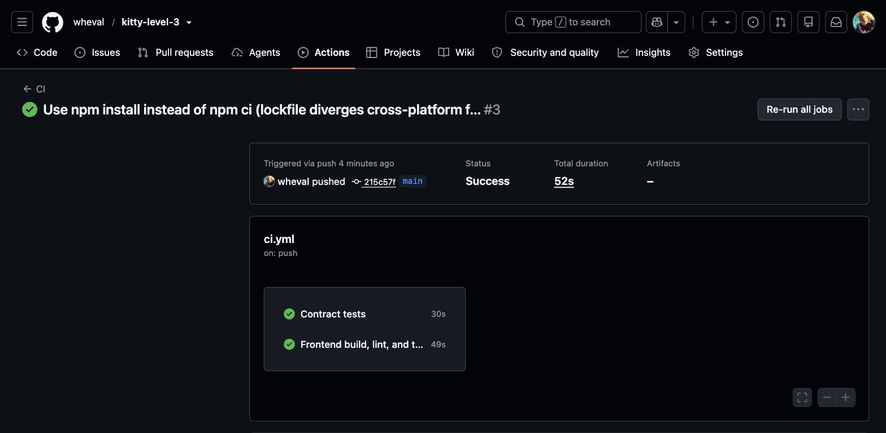
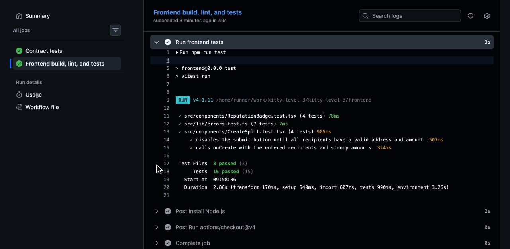
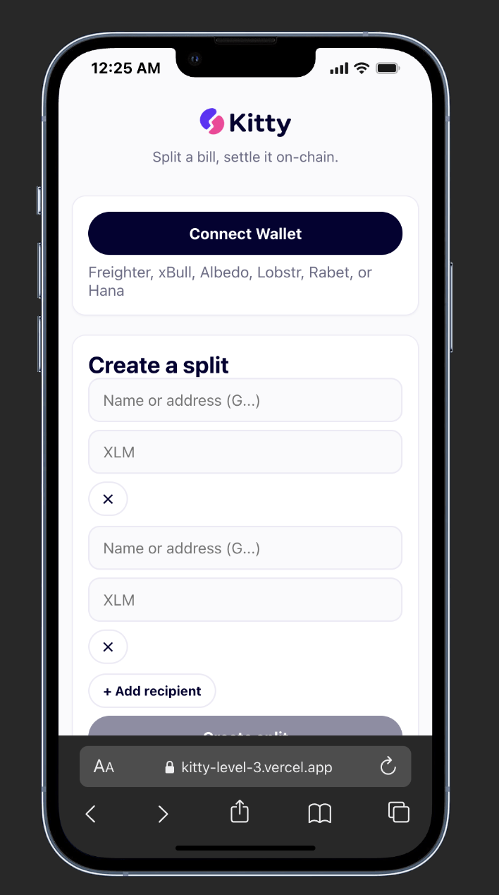

# 🐱 Kitty — Level 3 (Orange Belt)

[](https://github.com/wheval/kitty/actions/workflows/ci.yml)

The shared account for the family you support back home — split recurring costs across everyone who should be carrying them, settle instantly on-chain, and build an on-chain reputation for who actually shows up. A production-shaped Stellar dApp: two Soroban contracts talking to each other, real-time event sync, CI/CD, and a tested, mobile-responsive frontend.

**Live demo:** https://kitty-level-3.vercel.app

## What's new since Level 2

Level 2 was one contract (`KittySplit`) and one wallet flow. Level 3 adds:

- **A second contract, `KittyReputation`**, and a genuine **inter-contract call**: when `pay_share` succeeds on `KittySplit`, it calls `record_payment` on `KittyReputation` *in the same transaction* — no separate step, no off-chain bridge. Verified end-to-end on real testnet (see [Architecture](#architecture) below).
- **CI/CD**: GitHub Actions runs `cargo test` for both contracts and `npm run build` + `vitest` for the frontend on every push.
- **Frontend tests**: Vitest + React Testing Library, 21 passing tests across 4 files (error classification, split-creation form validation, reputation badge rendering, saved contacts).
- **Mobile-responsive layout**: a dedicated breakpoint, touch-sized tap targets, and a single-column layout under 480px.
- **Loading states**: skeleton loaders while split/reputation data is being fetched, not just error states.

## Production-hardening pass

The first version of this app worked but read as a demo, not a product — no routing, hardcoded config, no crash isolation, an unsplit bundle, and default Vite branding. Fixed:

- **Real routing (`react-router-dom`)**: `/app/split/:id` is an actual, shareable, deep-linkable URL — not "paste an ID into a text box." A `vercel.json` rewrite rule makes direct visits work in production too (verified: this genuinely 404'd before the rewrite was added).
- **Environment-based config**: contract IDs and network settings come from `VITE_*` env vars (see `.env.example`), with the current testnet deployment as the fallback default — so the same code can point at a different deployment or network without editing source.
- **Error boundary**: a render crash shows a recoverable error screen instead of a blank page.
- **Code splitting**: the wallet kit (which pulls in SDKs for every supported wallet, including hardware wallets like Trezor/Ledger) is now lazy-loaded on first "Connect Wallet" click via dynamic `import()`, instead of shipping in the initial bundle. Each wallet module is its own chunk, loaded only if needed.
- **Recent splits**: a lightweight localStorage-backed "recent splits" list on the home page, so returning users don't lose track of splits they've viewed or created.
- **Real branding**: proper page title, meta description, Open Graph tags, and a favicon — not the default Vite template.

## Rebrand + a real address book

The app was rebuilt around Kitty's actual logo (violet `#6030FA` / pink `#FD3599` / ink `#050232`) — no cat, no mascot, just the mark. This included:

- A **marketing landing page** at `/` explaining the product before anyone connects a wallet — hero, differentiators, and an honest "available now vs. coming next" section, so the ambitious pitch (cross-border, group savings, social-handle payments) stays truthful about what Level 3 actually ships. The functional app moved to `/app`.
- **Saved contacts**: save a friend's address once with a name, then split to "Alice" instead of pasting a 56-character address every time you create a split. Names resolve both ways — typing a name in the split form autocompletes to their address, and any address that matches a saved contact displays as their name throughout the app (split status, live activity feed). Local to your browser (`localStorage`), tested (`src/lib/contacts.test.ts`).
- Caught and fixed a real bug in the process: leftover Vite-template CSS (`index.css`) was overriding heading colors under `prefers-color-scheme: dark`, making the landing page headline nearly invisible for anyone with a dark-mode OS preference — found by actually looking at the rendered page, not just the code.

## Architecture

```
┌──────────────┐   pay_share(split_id, payer)   ┌──────────────┐
│   Frontend   │ ─────────────────────────────▶ │  KittySplit  │
│ (React + TS) │                                 │  contract    │
└──────────────┘                                 └──────┬───────┘
       ▲                                                 │
       │ get_score(address)                              │ 1. token.transfer(payer → creator)
       │                                                 │ 2. record_payment(split_contract, payer, amount)
       │                                                 ▼
       │                                          ┌──────────────┐
       └───────────────────────────────────────── │ KittyReputation │
                                                    │   contract      │
                                                    └─────────────────┘
```

`record_payment` only accepts calls where `split_contract.require_auth()` succeeds **and** matches the address `KittyReputation` was initialized with — so only the real `KittySplit` deployment can write reputation data, not an arbitrary caller.

## Contracts

- **Network:** Stellar Testnet
- **KittySplit contract ID:** `CCXLPKQCXVHAYW7UNZWLCAW54NBCGP754OEFGWPUQ5PNJPTREMMXUEHY`
- **KittyReputation contract ID:** `CCPDWYE2RPQ7RZSJNITNMFB3JMPSZWL7NH4BIRT44XDPZ2X4TICQKVSQ`
- **Cross-contract call, verified on-chain:** [`41398a124eb5fe228721a4f603c33a7b7c32a20c406110ddca0226a5c86e21e7`](https://stellar.expert/explorer/testnet/tx/41398a124eb5fe228721a4f603c33a7b7c32a20c406110ddca0226a5c86e21e7) — this `pay_share` call transferred XLM **and** wrote to `KittyReputation` in one transaction; confirmed by querying `get_score` immediately after.

Full deployment details, redeploy steps, and every verification step: [`../contract/DEPLOYMENT.md`](../contract/DEPLOYMENT.md).

Source: [`../contract/contracts/kitty-split`](../contract/contracts/kitty-split), [`../contract/contracts/kitty-reputation`](../contract/contracts/kitty-reputation).

## Tech stack

- **Contracts:** Rust, Soroban SDK 27, deployed via `stellar` CLI
- **Frontend:** React + TypeScript (Vite), [`@stellar/stellar-sdk`](https://github.com/stellar/js-stellar-sdk), [`@creit.tech/stellar-wallets-kit`](https://github.com/Creit-Tech/Stellar-Wallets-Kit) for multi-wallet support
- **Testing:** `cargo test` (contract unit tests, 7 total), Vitest + React Testing Library (frontend, 15 total)
- **CI/CD:** GitHub Actions (`.github/workflows/ci.yml`)
- **Hosting:** Vercel, with an SPA rewrite (`vercel.json`) so client-side routes work on direct navigation

## Setup instructions

### Prerequisites

- Node.js 20+ (CI uses Node 22)
- A Stellar wallet extension (Freighter, xBull, Albedo, Lobstr, Rabet, or Hana), set to **Testnet**
- A funded testnet account — `https://friendbot.stellar.org/?addr=YOUR_ADDRESS`

### Run locally

```bash
npm install
cp .env.example .env.local   # optional — defaults already point at the deployed testnet contracts
npm run dev
```

### Build

```bash
npm run build
```

### Run frontend tests

```bash
npm run test        # single run
npm run test:watch  # watch mode
```

### Run contract tests

```bash
cd ../contract
cargo build -p kitty-reputation --target wasm32v1-none --release  # kitty-split's contractimport! needs this first
cargo test --workspace
```

## CI/CD

Every push to `main` runs two parallel jobs (see `.github/workflows/ci.yml`):

1. **Contract tests** — builds `kitty-reputation`'s wasm (required by `kitty-split`'s `contractimport!`), then `cargo test --workspace` across both contracts.
2. **Frontend build, lint, and tests** — `npm install`, `npm run build` (which runs `tsc -b` then `vite build`), then `npm run test` (Vitest).

## Usage

1. Land on `/` — the marketing page. Click **Launch app** to go to `/app`.
2. Connect your wallet.
3. **Create a split** — type a recipient's saved name (autocomplete) or paste their address directly; add their share amount. This calls `create_split` and redirects you to `/app/split/:id`.
4. **That URL is shareable** — send it to the people who owe money, or they can look it up from the app home page. Each recipient connects their own wallet on that page and **pays their share** — this calls `pay_share`, which pays the creator directly and reports the payment to `KittyReputation` in the same transaction.
5. Connected wallets see their on-chain **reputation badge** — total shares paid on time and total XLM settled — read live from `KittyReputation.get_score`.
6. Payments from any browser tab appear in **Live activity** automatically via event polling, and paid/pending badges update without a manual refresh.
7. The app home page remembers **recent splits** you've viewed or created, and lets you manage **saved contacts** (stored locally in your browser).

## Screenshots

- [x] **CI/CD pipeline running** (GitHub Actions, both jobs green)

  

- [x] **Test output** (captured from the live CI run, not just local — 15 passing at the time of capture; 21 pass today, see [Testing](#tech-stack))

  

- [x] **Mobile responsive UI** (real iPhone Safari, `kitty-level-3.vercel.app`)

  

## Demo video

[Watch the walkthrough](https://youtu.be/xaEtyd46ZUs) — wallet connect, creating a split by saved contact name, real on-chain settlement, live activity updates, and on-chain reputation.

## Notes

This level's scope: a second contract, real inter-contract communication, CI/CD, frontend testing, mobile responsiveness, and loading states — all layered onto the same Kitty bill-splitting core from Levels 1–2. Stablecoin settlement, cross-border path payments, send-to-social-handle addressing, and ZK-private splits (hiding amounts and participants) — the full Kitty product vision — remain scoped for future work.
